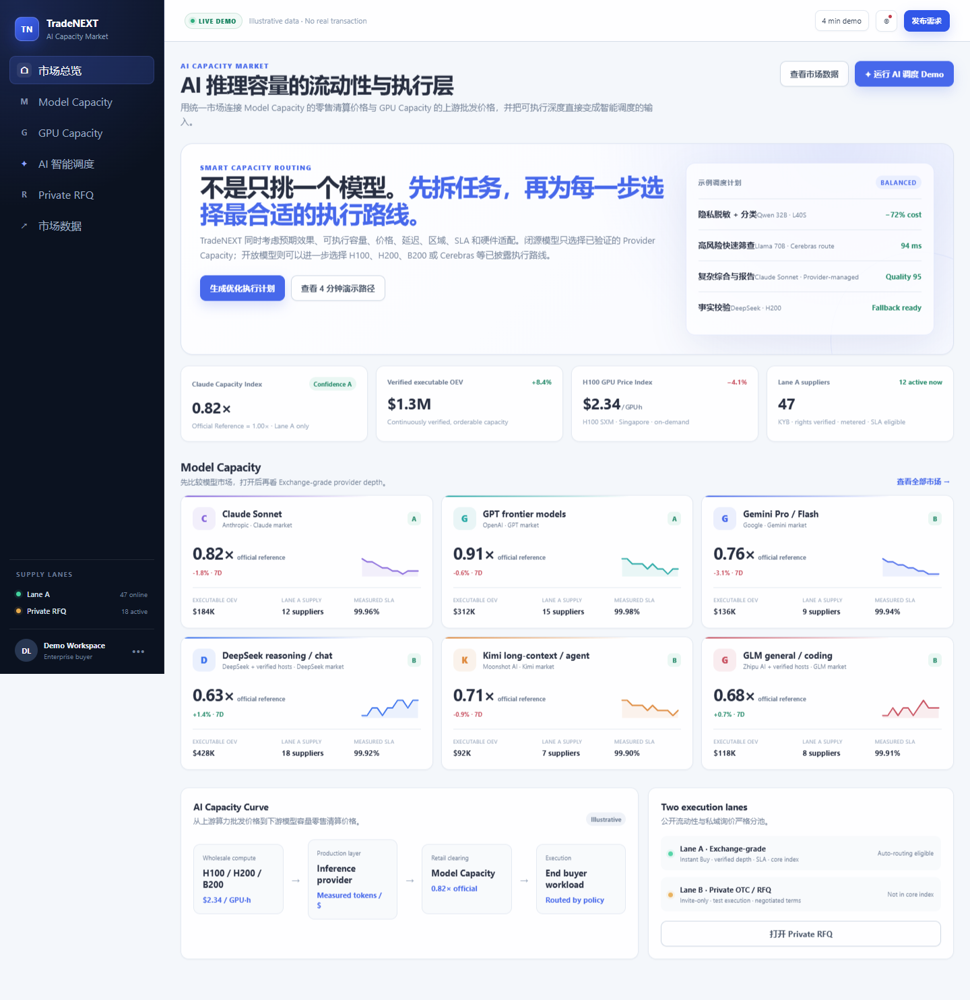
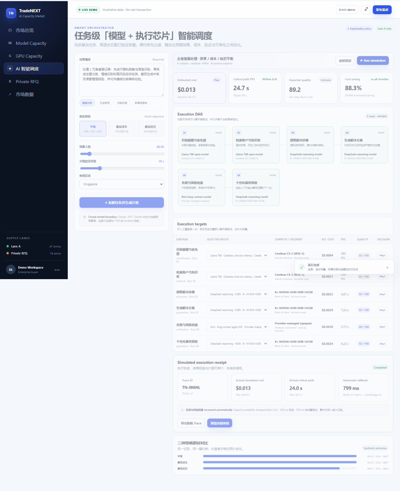

# TradeNEXT AI Capacity Market — Demo MVP

TradeNEXT 是面向 AI 推理容量的流动性、执行与市场数据层。这个可交互 Demo 将两类相关但不同的市场放进同一个产品框架：

- **Model Capacity**：Claude、GPT、Gemini、DeepSeek、Kimi、GLM 等模型的可执行推理容量。
- **GPU Capacity**：H100、H200、B200、L40S 与其他 AI 加速器的标准卡时和预约容量。

产品采用两条严格隔离的执行通道：

- **Lane A — Exchange-grade**：可即时购买、可预留、带 SLA、进入公开深度并具备核心指数资格。
- **Private OTC / RFQ**：承接大额、长期和非标准需求，经 KYB、容量测试、私密报价、Broker 协调和合同结算完成交易；不进入公开库存或核心指数。



## Smart Orchestrator

Demo 内置任务级 AI 调度器。它不只是为整个请求挑一个模型，而是先把复杂任务拆成多个有依赖关系的子任务，再为每一步选择合适的执行目标：

`model + delivery route + region + verified capacity/SLA + disclosed compute`

调度器支持：

- Balanced、Lowest cost、Lowest latency 三种多目标策略。
- 预算、关键路径时限、区域、质量门槛等硬约束。
- 可编辑执行 DAG 与每一步的人工路线覆盖。
- 预计质量、成本、p95 延迟、容量、执行硬件和选择原因。
- Cerebras、H100、H200、B200、L40S 等已披露开放模型/自托管执行路线。
- 闭源模型的 Provider-managed Capacity 路线。
- 供应路线故障、自动回退、Plan vs Actual 与脱敏 Trace 回执。



## 快速启动

要求：Node.js 18 或更高版本，无需安装第三方依赖。

```bash
npm start
```

然后打开 `http://127.0.0.1:4173`。

检查所有 JavaScript 模块：

```bash
npm run check
```

## 4 分钟演示路径

1. 从市场总览解释 Model Capacity 是推理容量零售层，GPU Capacity 是上游算力批发层。
2. 打开 Claude Sonnet，查看 Lane A Provider Depth、OEV、RPM/TPM、SLA 与 Instant Buy。
3. 进入 Smart Orchestrator，使用“客服分析”任务生成 6 步执行计划。
4. 对比三种策略，查看每一步的模型、供应路线、芯片、成本、延迟与 Why 解释。
5. 运行 Simulation，观察一次自动故障切换与最终执行回执。
6. 打开 Private RFQ，展示 Broker、容量测试和匿名私密报价流程。

## 市场数据

Demo 包含 TMCI、TGPI、AI Capacity Curve，以及与核心指数隔离的 OTC/RFQ 指标。

## 数据与合规边界

本仓库是产品 Demo，不是生产交易系统。

- 所有行情、供应商、库存、SLA、指数、运行结果和节省比例均为 **synthetic / illustrative demo data**。
- 不包含、不接收也不公开交易任何裸 API Key。
- 买方看到的是通过 TradeNEXT Gateway 交付的受控容量，而不是上游凭证。
- Claude、GPT、Gemini 等闭源模型未披露底层硬件时，一律显示为 `Provider-managed / hardware undisclosed`。
- 只有开放模型、自托管路线或供应方可验证披露的路线才显示具体芯片。
- AI 自动调度只消费符合条件的 Lane A 容量；Private RFQ 供给必须完成验证、测试和签约后才能成为受控分配容量。
- 核心指数只使用符合资格的 Lane A 数据；OTC 数据单独统计，永不混池。

## 验收

发布版已通过浏览器端闭环测试：市场导航、六个模型详情、GPU 字段、任务拆解、6/6 人工改路、故障切换、执行回执、RFQ 数据隔离、移动端布局，以及无页面脚本/控制台错误。

完整验收结果见 [`docs/qa-report.json`](docs/qa-report.json)。

## 当前状态

这是用于产品演示、用户访谈和合作方沟通的前端 MVP。真实供应接入、身份与权限、资金托管、生产计量、账单结算、合规审查和实时市场数据均属于后续生产化范围。
